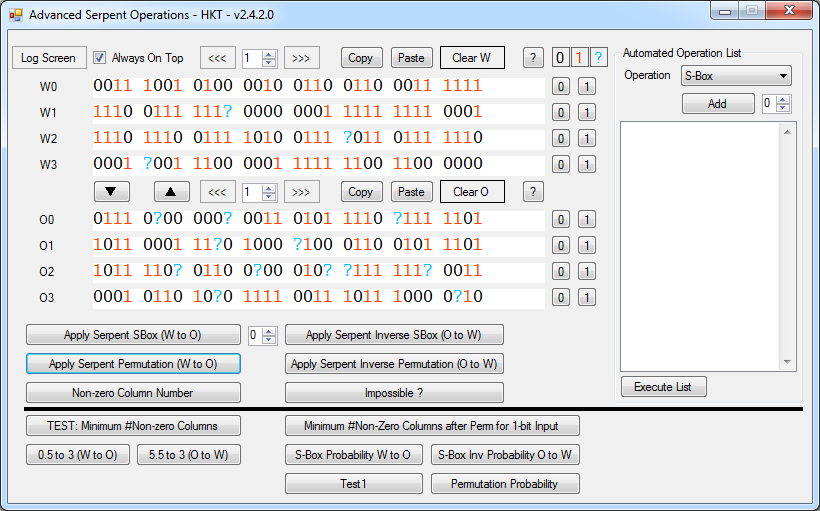

Serpent
=======

This solution mainly aims to analyze the differential characteristics of the SERPENT cipher which is a finalist in AES contest.

Coding is done using C# 4.0 and Visual Studio 2012. The solution contains two projects called LibSerpent and AdvancedSerpentOperations.

LibSerpent Library
------------------

LibSerpent namespace is the library that implements core operations for the SERPENT Cipher. There are two classes named Serpent and Word. Word class implements a 3-state binary number library. Simply, you can define a binary string consisting 0,1 and ?. So, this makes it easy to trace some bits in the cipher. Serpent class implements both core cryptographic operations of the cipher and some analyze functions for the cipher.

AdvancedSerpentOperations Program
---------------------------------

AdvancedSerpentOperations project uses the LibSerpent library and allows to analyze input and outputs using GUI. It mainly enables to analyze the cipher's differential characteristic and some other information about cipher. GUI is very simple to use and user friendly.

Here is a screenshot of the program

